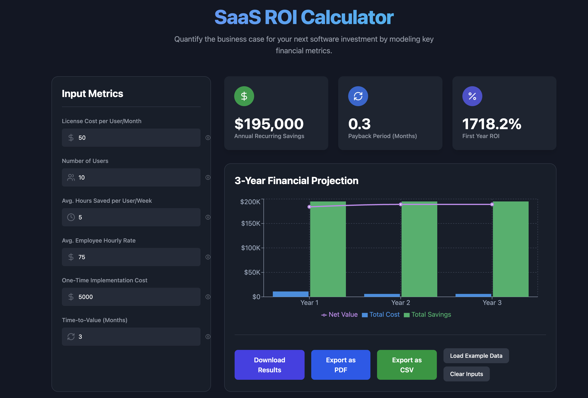

# 📈 SaaS ROI Calculator

A sleek, interactive calculator to model the return on investment (ROI) for B2B SaaS products. Designed with React, Tailwind CSS, and Chart.js, this project combines financial logic with beautiful visualizations to help software buyers and sellers assess value at a glance.



🚀 [Live Demo](https://saas-roi-calculator.netlify.app/)

---

## 💡 About the Project

This tool helps quantify the business case for adopting a new SaaS product by modeling:

- **Annual Recurring Savings**
- **Payback Period (Months)**
- **First-Year ROI**
- **3-Year Financial Projections**

Built to support enterprise sales professionals, solution engineers, and founders pitching high-impact software.

---

## ✨ Key Features

- 🔢 **Input Metrics Panel**: Accepts cost, usage, time savings, hourly rates, and more.
- 📊 **Interactive Bar Chart**: Forecasts cost vs. savings over 3 years.
- 🧠 **Dynamic Calculations**: Instant feedback on ROI, TTV, and payback.
- 💾 **Downloadable Results**: Export to PDF or CSV.
- 💡 **Helpful Tooltips**: Hover for contextual explanations.
- 🧪 **Validation and UX Polish**: Includes input masking, clean layout, and smooth interactions.

---

## 🛠️ Tech Stack

- **Frontend**: React + TypeScript + Vite
- **Styling**: Tailwind CSS + PostCSS
- **Charts**: Chart.js via react-chartjs-2
- **Utilities**: jsPDF, FileSaver, React Tooltip

---

## 🚀 Getting Started

### Prerequisites

- Node.js v18+ (Volta recommended)
- npm

### Installation

```bash
git clone https://github.com/yourusername/saas-roi-calculator.git
cd saas-roi-calculator
npm install
npm run dev
```

Open [http://localhost:5173](http://localhost:5173) in your browser.

---

## 📤 Export Options

- **PDF Export**: Click “Download PDF” to generate a styled financial report.
- **CSV Export**: Useful for integrating with Excel, Sheets, or BI tools.

---

## 📁 Project Structure

```bash
src/
├── components/
│   └── InputForm.tsx
│   └── ResultCards.tsx
│   └── Chart.tsx
├── utils/
│   └── calculations.ts
│   └── exportHelpers.ts
├── App.tsx
├── main.tsx
```

---

## 🧠 Learnings & Purpose

This project is part of a personal portfolio aimed at showcasing real-world financial modeling with interactive UI. Perfect for:
- Technical presales engineers
- Product marketers
- SaaS founders
- Data-driven sales teams

---

## 📜 License

MIT

---

**Disclaimer** | This is a personal portfolio project to demonstrate technical skill. It is not a financial analysis tool and should not be used for investment decisions. |

## ✍️ Author

[Elias Kizito](https://eliaskizito.com) 
